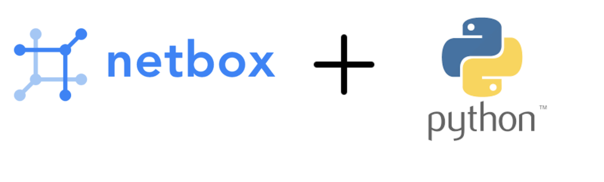

# Implementation of the Data Model on Netbox: A Source of Truth using Python.



## Description

This repo consists of codes for implementing a basic data model on Netbox instance using python

## Usage

```bash
git clone git@github.com:NetOpsChic/netbox-playground.git
```

```bash
python3 data-model.py
```

## Contact

netopschich@gmail.com

## Author

@NetOpsChic
